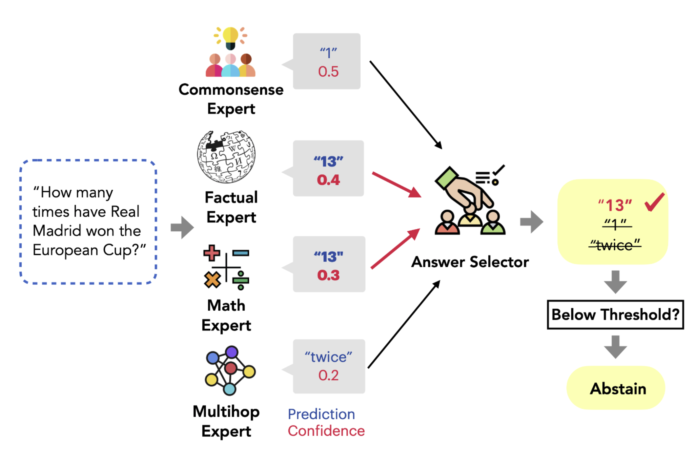

# Getting <u>MoRE</u> out of <u>M</u>ixture <u>o</u>f Language Model <u>R</u>easoning <u>E</u>xperts

<p align="center">
    
</p>

## Data

All the model prediction data can be downloaded from [this link](https://drive.google.com/file/d/1GYF-dq9N5XFd3w97AQO_fR5ArCQpwrpC/view?usp=sharing).
Once you download it, unzip it and put it under the `uniqa_predictions_final` folder.

It contains two subsets: one for dev set and another for test set. All our evaluation results are based on the test sets. Each subset should contain the experts' (and the dataset-specific few-shot baseline's) predictions on all the 12 datasets used in our paper. 

## Training the Router 

You can run `python3 feature_classifier.py` to train the random forest router and run inference to score all predictions. For ablation, you can set `agreement = False` to exclude the inter-expert agreement features; or you can also set `qonly = True` to train a router that only uses the question features (see more detailed in the paper).

## Generalizability Evaluation

Once you run inference and save the router scores (which we already provided in `feature_classifiers`), you can run `python3 ensemble.py` to reproduce all results reported in Table 1, The default method is `classifier`, which uses the router classifier's scores for answer selection; you can also set to other methods for comparison. 

## Selective QA Evaluation 

For the selective QA evaluation, run `python3 abstention.py`. You can use either MaxProb or the router's score to score predictions by setting `method` correspondingly and set the `metric` among `AUC`, `Cov@80`, and `Cov@90` in the `all_metric` function. Use the `ER_metric` function to compute the effective reliability, which involves first searching for a threshold based on the dev set. 

## Citation

```bibtex
@article{si2023mope,
   title={Mixture of Prompt Experts for Generalizable and Interpretable Question Answering},
   author={Si, Chenglei and Shi, Weijia and Zhao, Chen and Zettlemoyer, Luke and Boyd-Graber, Jordan},
   journal={arXiv preprint},
   year={2023}
}
```

If you have any questions about the code or paper, feel free to email Chenglei (sichenglei1125@gmail.com). 

